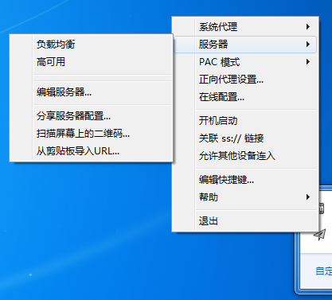
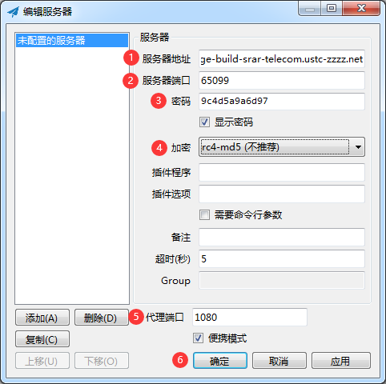

[<< 上一节：下载 Shadowsocks](1.md)

# 配置 Shadowsocks

**本教程提供的 Shadowsocks 已经全部配置完成，所以如果是在本教程中下载的 Shadowsocks 则可以跳过这个步骤。**

如果你是从其他渠道下载的 Shadowsocks，或者是其他支持 Shadowsocks 协议的代理软件，可以按照以下步骤配置：  
1. 右键任务栏托盘 Shadowsocks 图标，依次选择「服务器」—「编辑服务器...」  
      
1. 在「编辑服务器」对话框中，依次输入以下内容： 
   > 服务器地址：forge-build-srar-telecom.ustc-zzzz.net  
   > 服务器端口：65099  
   > 密码：9c4d5a9a6d97  
   > 加密：rc4-md5  
   > 代理端口：1080  

   输入完成后，单击「确定」按钮即可

      

*此代理服务器只能用于构建 Minecraft Forge 开发环境，并不能访问外国网站。*

如果想要退出 Shadowsocks，只需要右键任务栏托盘中的 Shadowsocks 图标并单击「退出」即可。

[>> 下一节：下载 Proxifier](3.md)