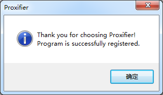

[<< 上一节：下载 Proxifier](3.md)

# 安装 Proxifier

1. 双击下载到的 ProxifierSetup.exe  
1. 单击「Next」按钮  
   
1. 选中「I accept the agreement」单选框，并单击「Next」按钮  
   
1. 如果想修改软件安装位置的，那么单击「Browse...」按钮并选择自己想要的安装位置，然后单击「Next」按钮  
   
1. 如果想修改开始菜单快捷方式位置的，那么单击「Browse...」按钮并选择自己想要的安装位置（这个一般不需要改），然后单击「Next」按钮  
   
1. 三个复选框按需勾选，建议取消前两个和勾选最后一个，并单击「Next」按钮  
   
1. 单击「Install」按钮  
   
1. 勾选「Launch Proxifier」复选框，并单击「Finish」按钮  
   

这样我们就安装好了 Proxifier，下次启动时可以从桌面快捷方式启动，或者在软件安装位置下双击 Proxifier.exe 启动。启动 Proxifier 后默认不会弹出窗体，需要单击任务栏托盘中的 Proxifier 图标。

第一次启动 Proxifier 时需要输入注册码，按以下步骤操作：
1. 单击「Enter Registration Key...」按钮   
   
1. 第一个文本框随便写，第二个文本框输入「5EZ8G-C3WL5-B56YG-SCXM9-6QZAP」，然后选择「All users on this computer (require administrator)」单选框，最后单击「OK」按钮  
   
1. 如果弹出这个对话框，说明注册成功了，如果不是，那么就换用其他注册码（请自行百度搜索「Proxifier 注册码」）  
   

[>> 下一节：配置 Proxifier](5.md)
