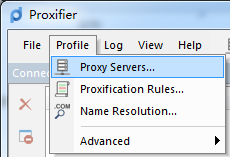

[<< 上一节：安装 Proxifier](4.md)

# 配置 Proxifier

成功启动 Proxifier 之后，可以在此处下载配置文件，然后按以下步骤操作以替换原先 Proxifier 默认的配置文件：  
1. **单击[此处](https://gitee.com/zekerzhayard/minecraft-forge-proxy-tutorial/attach_files/1122220/download/MinecraftForge.ppx)下载 Proxifier 的配置文件「MinecraftForge.ppx」**
1. 依次选择左上角「File」—「Import Profile...」  
   
1. 在弹出的对话框中单击「是(Y)」按钮  
   
1. 选择刚刚下载到的「MinecraftForge.ppx」文件，然后单击「打开(O)」按钮
   

这样就导入了配置文件，然后按照配置 Minecraft Forge 开发环境的步骤操作即可。

如果想要退出 Proxifier，只需要右键任务栏托盘中的 Proxifier 图标并单击「Exit」即可。

---
如果你已经导入了配置文件，那么以下步骤可以全部**跳过**，如果有需求手动配置 Proxifier，那么按以下步骤操作：
1. 依次选择左上角「Profile」—「Proxy Servers...」  
   
1. 在弹出的对话框中单击「Add...」按钮  
   
1. 在弹出的对话框中依次填入以下内容：  
   >Address：127.0.0.1  
   >Port：1080  
   >Protocol：HTTPS  

   其余保持默认，然后单击「OK」按钮  
   
1. 在弹出的这个对话框中，单击「否(N)」按钮  
   
1. 然后单击「OK」按钮  
   
1. 在弹出的这个对话框中，单击「是(Y)」按钮  
     
   如果单击了「否(N)」，那么可以在左上角「Profile」—「Proxification Rules...」中进行下一步  
   
1. 在弹出的窗口中单击「Add...」按钮  
   
1. 在弹出的窗口中依次填入以下内容  
   >Name：随便写  
   >Applications：java.exe  
   >Target hosts：\*.apache.org; \*.gradle.org; \*.gradle\*.com; \*.minecraft.net; \*.minecraftforge.net; \*.mojang.com  
   >Action：Proxy HTTPS 127.0.0.1
   
   其余保持默认，然后单击「OK」按钮  
   
1. 然后单击「OK」按钮  
   
1. 依次选择左上角「Profile」—「Name Resolution...」  
   
1. 在弹出的窗口中**取消**勾选「Detect DNS Settings automatically」，并勾选「Resolve hostnames through proxy」，其余保持默认，然后单击「OK」按钮  
   

这样，Proxifier 就配置完成了。
