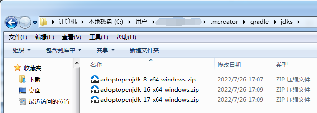

[<< 上一节：配置 Proxifier](5.md)

# MCreator 需要的额外步骤

MCreator 不会使用环境变量里的 JAVA_HOME ，而是将 JAVA_HOME 指向自带的 JDK；  
由于新版 MCreator 自带的 JDK 不是 JDK 8，所以当构建 Minecraft 1.16.5 或更早版本的开发环境时会自动下载 AdoptOpenJDK 8；  
由于本教程中的代理服务器并不会代理下载 AdoptOpenJDK，所以需要手动下载对应版本的 JDK 并放到正确的位置上。

1. 退出 MCreator 并确保任务管理器的「进程」和「详细信息」中没有「java.exe」进程
1. 下载对应版本的 JDK：
   - [JDK 8 Windows 64 位](https://ghproxy.com/https://github.com/adoptium/temurin8-binaries/releases/download/jdk8u312-b07/OpenJDK8U-jdk_x64_windows_hotspot_8u312b07.zip) （适用于 Minecraft 1.16.5 或更旧版本）
   - [JDK 16 Windows 64 位](https://ghproxy.com/https://github.com/adoptium/temurin16-binaries/releases/download/jdk-16.0.2%2B7/OpenJDK16U-jdk_x64_windows_hotspot_16.0.2_7.zip) （适用于 Minecraft 1.17.x）
   - [JDK 17 Windows 64 位](https://ghproxy.com/https://github.com/adoptium/temurin17-binaries/releases/download/jdk-17.0.1%2B12/OpenJDK17U-jdk_x64_windows_hotspot_17.0.1_12.zip) （适用于 Minecraft 1.18 或更新版本）
1. 将下载到的压缩包重命名为以下名称并放入 `C:\Users\<你的用户名>\.mcreator\gradle\jdks` 文件夹内（没有对应文件夹就新建一个，如果文件夹内有其他文件就全部删除）：
   - JDK 8：adoptopenjdk-8-x64-windows.zip
   - JDK 16：adoptopenjdk-16-x64-windows.zip
   - JDK 17：adoptopenjdk-17-x64-windows.zip  
   
1. 重新运行 MCreator 并开始构建即可
